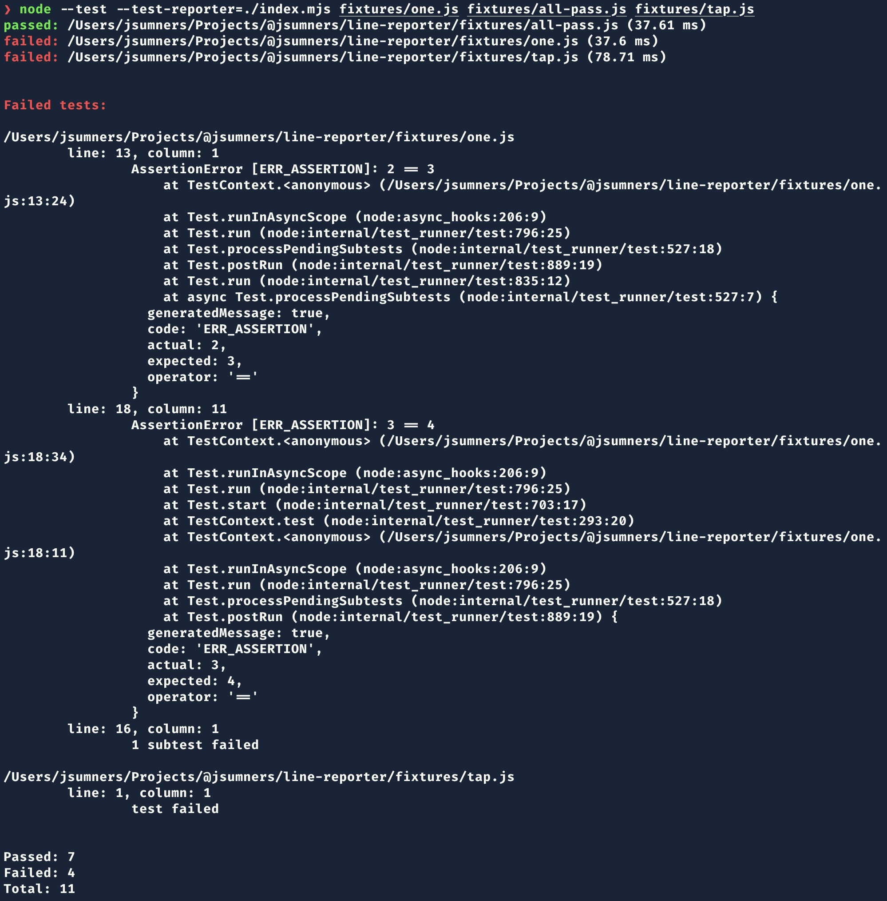

# @jsumners/line-reporter

This is a [`node:test` reporter][ntr] that only reports test suite passes
and failures. It does not report on invididual subtests within test suites,
except in the case of failures. Suites that have failed, will be summarized
at the end of the test run, and the causes listed out.

It supports reporting on [`tap@16`][tap] test suites. This is to facilitate
migrating from `tap` to `node:test`, if that is your desire.

Node.js 20 and later is supported.

## Configuration

The reporter supports two configuration options via environment variables.

1. `LINE_REPORTER_MODE`: accepts values of "quiet" or "silent". In either case,
the running list of passes and failures will be omitted, and only the final
summary will be reported. This is useful for CI. For example, GitHub Actions
will update its log file for every write to stdout. This can result in very
long log files that obscure the reason for CI failures. With this setting set,
the log file will be updated once: at the completion of the test run.

2. `LINE_REPORTER_LOCALE`: accepts any [valid locale string][locale]. The
default is "en-US". This is used to format the suite timings reported for
each passing or failing suite.

[ntr]: https://nodejs.org/docs/latest/api/test.html#test-reporters
[tap]: https://www.npmjs.com/package/tap
[locale]: https://developer.mozilla.org/en-US/docs/Web/JavaScript/Reference/Global_Objects/Intl/Locale/language
